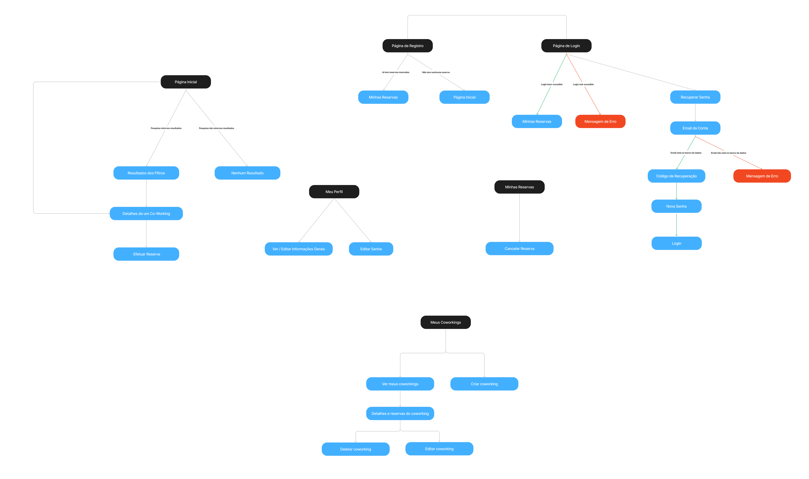

# Projeto de Interface

Pré-requisitos: <a href="2-Especificação do Projeto.md"> Documentação de Especificação</a>

Visão geral da interação do usuário pelas telas do sistema e protótipo interativo das telas com as funcionalidades que fazem parte do sistema (wireframes).

## User Flow

Figura 1: Fluxograma de usuário

## Wireframes

### Autenticação
Os primeiros protótipos que foram pensados foram os fluxos de autenticação onde os usuários podem fazer login, se registrar e recuperar a senha caso tenham perdido. Seguem abaixo as telas respectivas para cada situação.

Figura 2: Página de login

Figura 3: Página de registro

Figura 4: Página de recuperar senha: informar e-mail

Figura 5: Página de recuperar senha: informar código de recuperação

Figura 6: Página de recuperar senha: cadastrar nova senha

### Site principal
Nessa parte temos detalhadas as principais funcionalidades referente a tela principal, busca de coworkings, detalhes e reservas. Aqui focamos em atender a principal demanda do nosso público-alvo: acesso a uma lista fácil com opções de coworkings que me atendam, com fácil acesso a preços e orçamentos e reserva rápida de forma online.

Figura 7: Página inicial do site

Figura 8: Página de busca

Figura 9: Página de busca sem retorno

Figura 10: Página de detalhes e reserva

Figura 11: Página de pagamento aprovado

