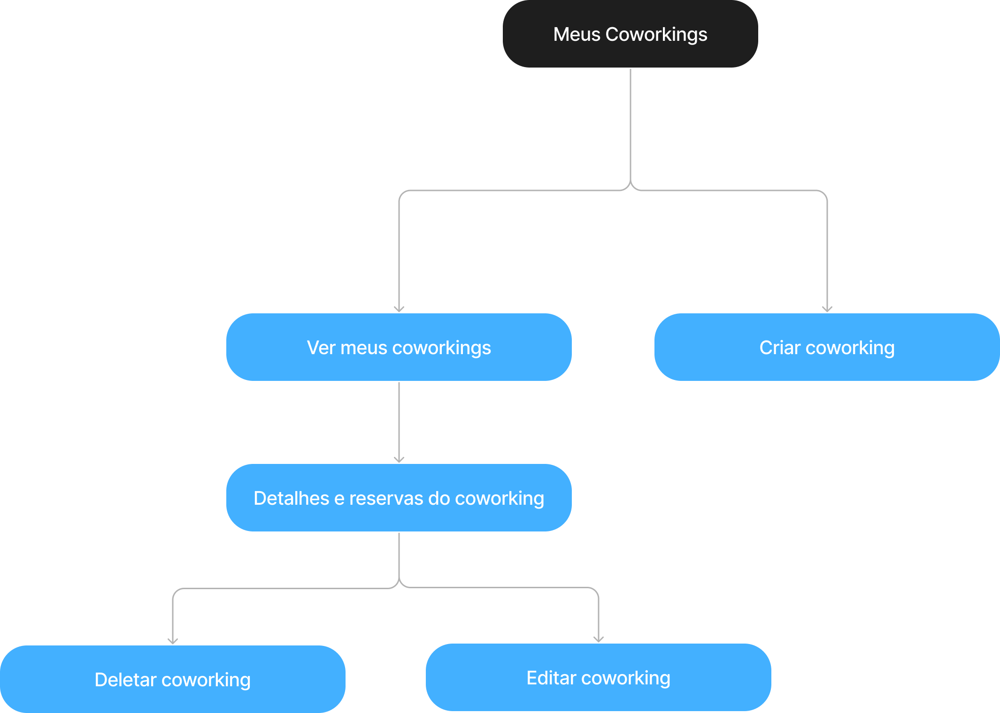
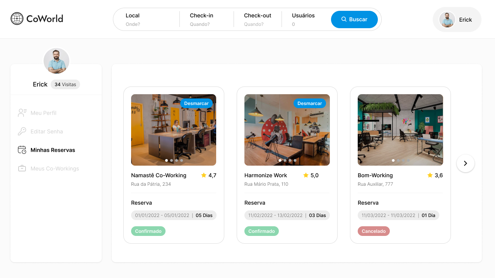

# Projeto de Interface

Pré-requisitos: <a href="2-Especificação do Projeto.md"> Documentação de Especificação</a>

Visão geral da interação do usuário pelas telas do sistema e protótipo interativo das telas com as funcionalidades que fazem parte do sistema (wireframes).

## User Flow

Figura 1: Fluxograma de usuário

### Página inicial

Figura 2: Fluxograma da página principal

Nessa parte, ao acessar o site o usuário será levado para a página principal onde pode fazer uma busca. A partir daí ele será levado para a página de resultados, podendo conter opções para os filtros selecionados por ele ou não. Caso haja opções, ele poderá abrir um anúncio e realizar a reserva. 

### Meu perfil

Figura 3: Fluxograma do perfil

Nessa parte o usuário será capaz de alterar seus dados como nome e email e também alterar sua senha caso haja necessidade. 

### Minhas reservas

Figura 4: Fluxograma das minhas reservas

Nessa parte o usuário será capaz de visualizar suas reservas e também efetuar o cancelamento de alguma reserva caso queira.

### Autenticação

Figura 5: Fluxograma de autenticação

Nessa parte o usuário pode logar caso já tenha uma conta ou efetuar o registro no sistema caso não seja registrado ainda. Ao entrar será levado para a página de buscas caso não tenha reservas ou para a página de reservas caso já haja alguma reserva. Caso o usuário tenha perdido sua senha, ele poderá efetuar a recuperação da mesma através do sistema que em algum momento será capaz de enviar um código de recuperação para que ele possa alterar sua senha. Dessa forma, o usuário informa o email, o código recebido e cadastra a nova senha.

### Meus coworkings

Figura 2: Fluxograma dos meus coworkings

Nessa parte atendemos a demanda daqueles que querem publicar espaços coworkings para aluguel. Aqui o usuário pode ver, criar deletar e editar coworkings. 

## Wireframes

### Autenticação
Os primeiros protótipos que foram pensados foram os fluxos de autenticação onde os usuários podem fazer login, se registrar e recuperar a senha caso tenham perdido. Seguem abaixo as telas respectivas para cada situação.

Figura 2: Página de login

Figura 3: Página de registro

Figura 4: Página de recuperar senha: informar e-mail

Figura 5: Página de recuperar senha: informar código de recuperação

Figura 6: Página de recuperar senha: cadastrar nova senha

### Site principal
Nessa parte temos detalhadas as principais funcionalidades referente a tela principal, busca de coworkings, detalhes e reservas. Aqui focamos em atender a principal demanda do nosso público-alvo: acesso a uma lista fácil com opções de coworkings que me atendam, com fácil acesso a preços e orçamentos e reserva rápida de forma online.

Figura 7: Página inicial do site

Figura 8: Página de busca

Figura 9: Página de busca sem retorno

Figura 10: Página de detalhes e reserva

Figura 11: Página de pagamento aprovado

### Perfil do usuário
Aqui disponibilizamos para o usuário um local para que possa administrar tanto seus perfis quanto suas reservas feitas, podendo até mesmo cancelá-las de maneira rápida, prática e objetiva, de forma que atenda a demanda de ser uma plataforma de fácil uso.

Figura 12: Perfil de usuário

Figura 13: Reservas do usuário

Figura 14: Cancelar reserva

Figura 15: Alterar senha

