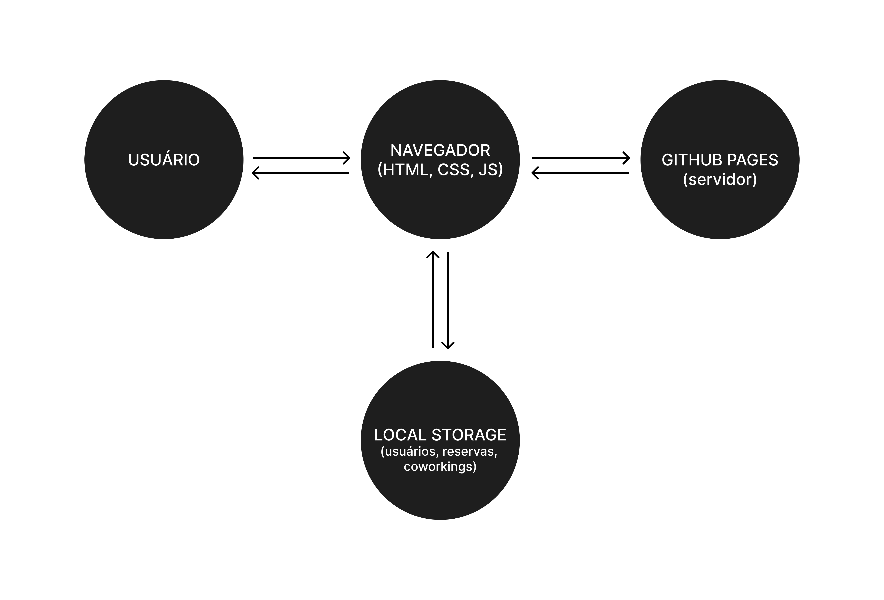

# Arquitetura da Solução

Pré-requisitos: <a href="3-Projeto de Interface.md"> Projeto de Interface</a>

Definição de como o software é estruturado em termos dos componentes que fazem parte da solução e do ambiente de hospedagem da aplicação.

## Diagrama de componentes

Figura 1: arquitetura do sistema

A solução implementada conta com os seguintes módulos:
- **Usuário** - Aquele que vai acessar todos os dados do sistema
- **Navegador** - Interface básica do sistema
   - **Local Storage** - armazenamento mantido no Navegador, onde são implementados bancos de dados baseados em JSON. São eles: 
     - **Usuários** - usuários cadastrados 
     - **Coworkings** - registro dos coworkings criados pelos usuários
     - **Reservas** - registro das reservas feitas pelos usuários
 - **Hospedagem** - local na Internet onde as páginas são mantidas e acessadas pelo navegador, nesse caso, sendo utilizado o GitHub pages por não possuir back-end. 

## Tecnologias Utilizadas

Nesta etapa do projeto será utilizado as 3 linguagens principais de desenvolvimento web fron-end: 

- `HTML`: estruturação das páginas
- `CSS`: estilização das páginas 
- `JavaScript`: desenvolvimento das interações das funcionalidades de cada página

Para a utilização dos resultados provenientes dessa arquitetura, o usuário ao acessar um site faz uma requisição inicial aos servidores do mesmo para ter acesso aos arquivos HTML, CSS e JS que serão armazenados localmente na máquina do usuário através do navegador, que será responsável por traduzir e exibir esses arquivos. 

A partir daí o usuário terá acesso à todos os arquivos traduzidos relacionados ao front-end. O front-end é responsável pela interação direta com o servidor e os dados armazenados nele. Porém, como nesta etapa do projeto não será desenvolvido back-end, podemos desconsiderar nesse momento inicial.

No diagrama abaixo, temos exemplificado como funciona a arquitetura de requisição e resposta entre um usuário e uma aplicação web.

Figura 2: diagrama de interações

## Hospedagem

Como nesta etapa do projeto estaremos trabalhando somente com desenvolvimento front-end sem necessidade de um servidor back-end, toda a parte de hospedagem de páginas será feita através do próprio GitHub Pages.
