# Template padrão do site

Pré-requisitos: <a href="2-Especificação do Projeto.md"> Especificação do Projeto</a>, <a href="3-Projeto de Interface.md"> Projeto de Interface</a>, <a href="4-Metodologia.md"> Metodologia</a>

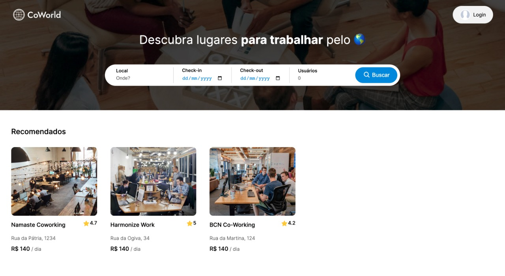

Figura 1: Homepage do site

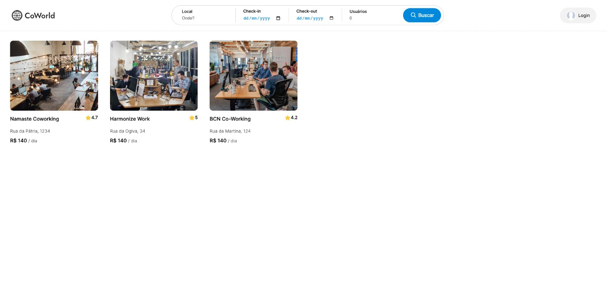

Figura 2: Página de pesquisa

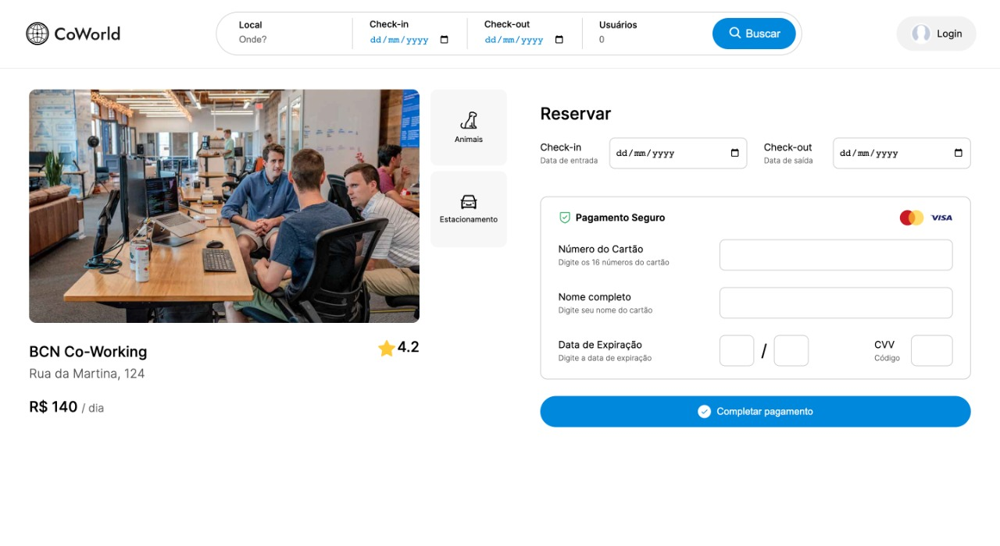

Figura 3: Página do coworking

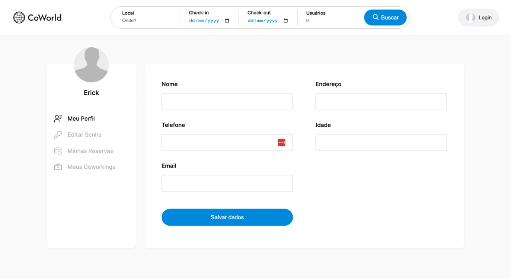

Figura 4: Perfil do usuário

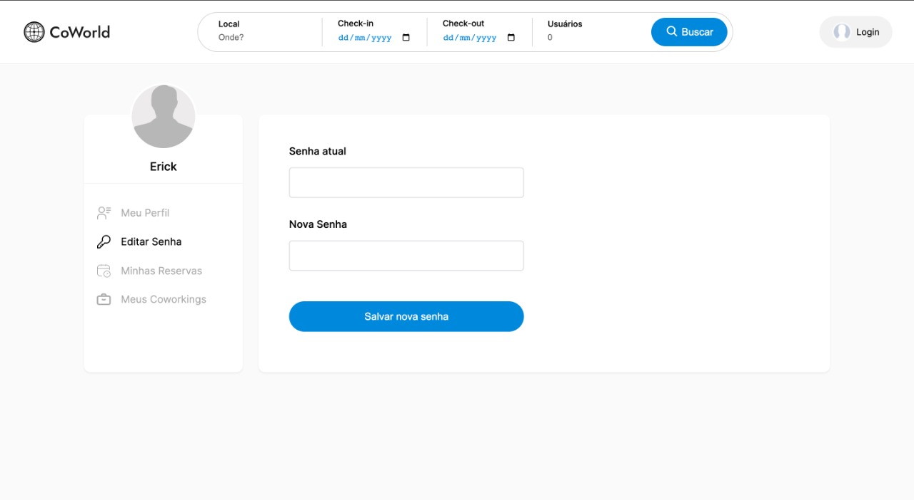

Figura 5: Configuração de senha

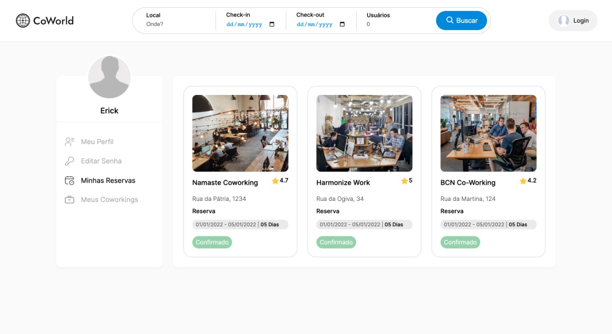

Figura 6: Minhas reservas

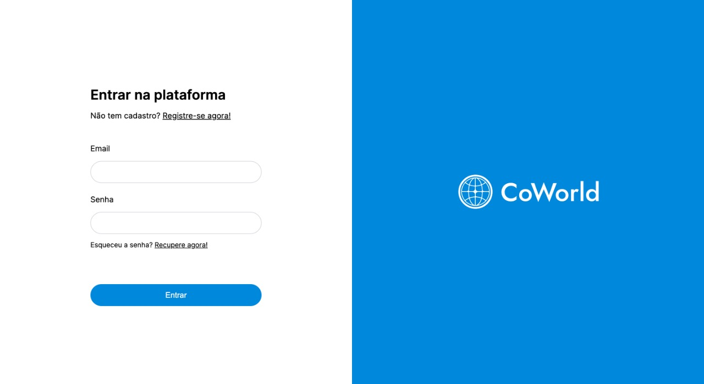

Figura 7: Página de login

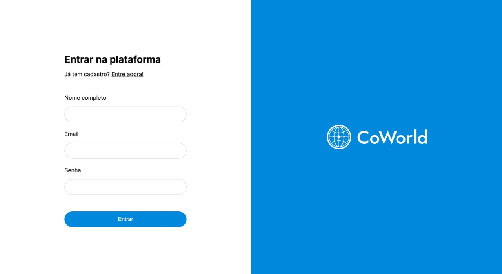

Figura 8: Página de registro

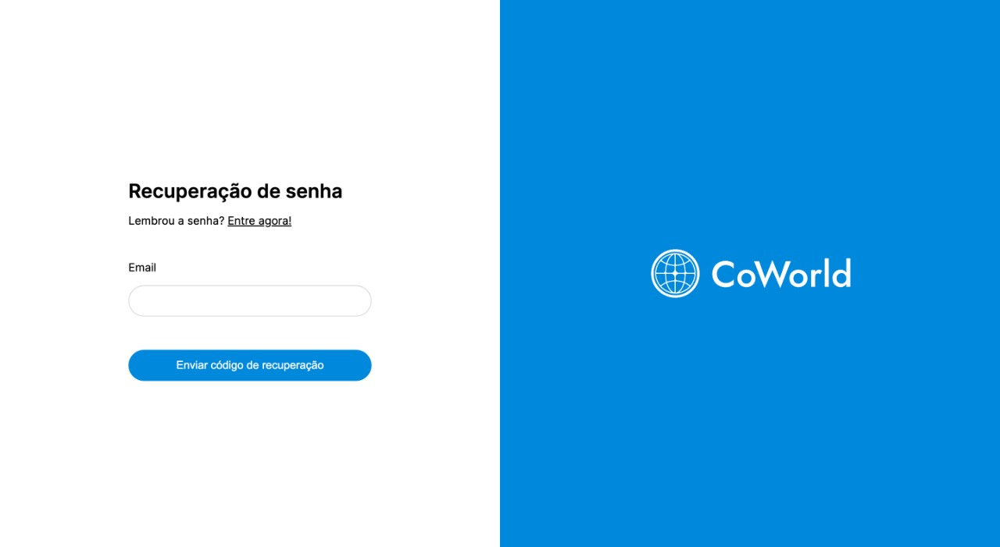

Figura 9: Página de recuperar senha

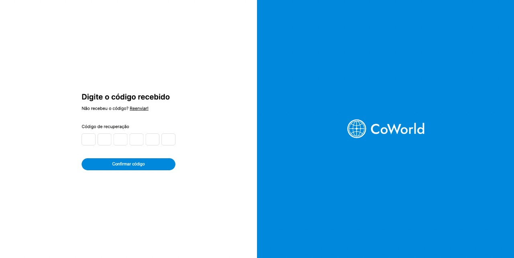

Figura 10: Página de código de recuperação

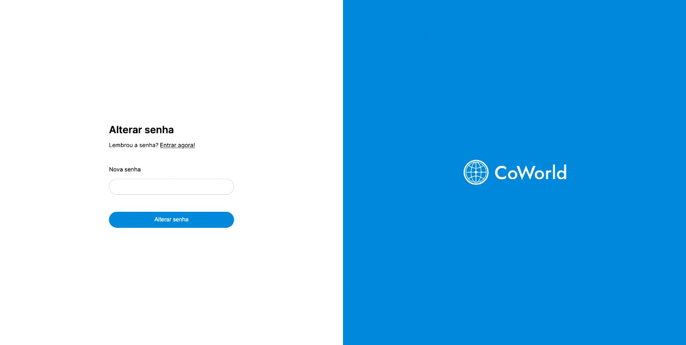

Figura 11: Página de alterar senha

