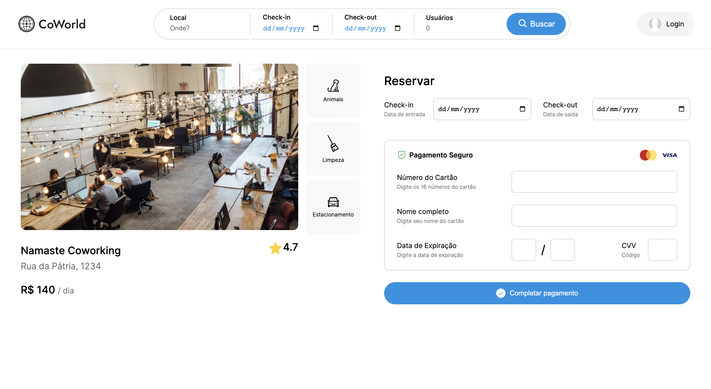

# Programação de Funcionalidades

## Listagem de coworkings

### Tela implementada


<p align="center">Figura 1: Tela com implementação da listagem</p>

### Estrutura de dados

A estrutura JSON utilizada para cada coworking segue o exemplo abaixo:

````
  {
    "id": 1,
    "name": "Namaste Coworking",
    "price": 140,
    "address": "Rua da Pátria, 1234",
    "rate": 4.7,
    "image": "https://www.contabilizei.com.br/contabilidade-online/wp-content/uploads/2020/10/coworking-escritorio-scaled-e1603737218960.jpg",
    "benefits": [
      {
        "name": "Animais",
        "icon": "animal.svg"
      },
      {
        "name": "Limpeza",
        "icon": "clean.svg"
      },
      {
        "name": "Estacionamento",
        "icon": "park.svg"
      }
    ]
  }
````

A implementação do código responsável pela listagem pode ser acessada [aqui](https://github.com/ICEI-PUC-Minas-PMV-ADS/pmv-ads-2022-2-e1-proj-web-t7-coworking-airbnb/blob/main/src/pages/index.js) e a página hospedada pode ser acessada [aqui](https://pmv-ads-2022-2-e1-proj-web-t7-coworking-airbnb.vercel.app/coworking.html?id=2).

## Página do coworking

### Tela implementada


<p align="center">Figura 2: Tela da página do coworking</p>

A implementação do código responsável pela listagem pode ser acessada [aqui](https://github.com/ICEI-PUC-Minas-PMV-ADS/pmv-ads-2022-2-e1-proj-web-t7-coworking-airbnb/blob/main/src/pages/coworking.js) e a página hospedada pode ser acessada [aqui](https://pmv-ads-2022-2-e1-proj-web-t7-coworking-airbnb.vercel.app/).
